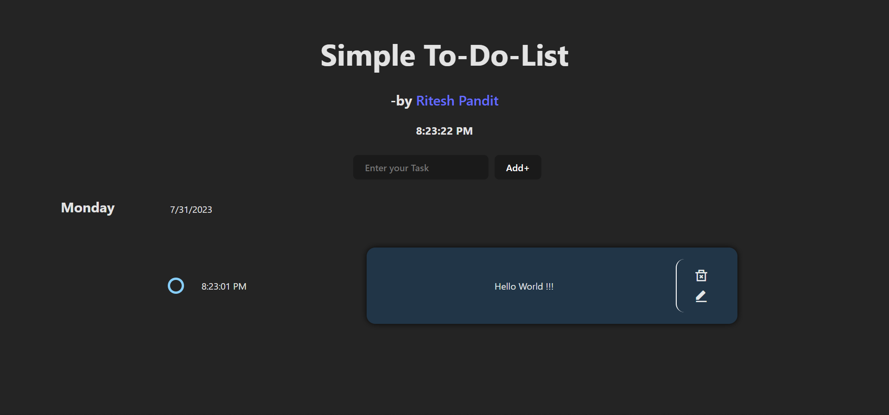

# Simple To-Do List

A basic To-Do List application built with React. This app allows users to add tasks for the current day and view them based on the day of the week.

## Table of Contents

-   [Description](#description)
-   [Screenshots](#screenshots)
-   [How to Run](#how-to-run)
-   [References](#references)

## Description

This project is a simple To-Do List application implemented in React. It provides a user-friendly interface for adding tasks and displaying them based on the day of the week. The application also includes features like time tracking and task editing.

## Screenshots



## How to Run

To run this application locally, follow these steps:

1. Clone the repository to your local machine:

```bash
git clone https://github.com/Riteshp2001/To-do-list.git
```

2. Install dependencies using npm (Node Package Manager):

```bash
cd To-do-list
npm install
```

3. Start the development server:

```bash
npm start
```

4. Open your web browser and navigate to http://localhost:3000 to access the application.

## References

This project was built using the following technologies and libraries:

-   React: A JavaScript library for building user interfaces.
-   eslint: A tool for identifying and reporting on patterns in JavaScript code.
-   The project also utilizes the "react/prop-types" eslint rule to disable prop-types checking.
